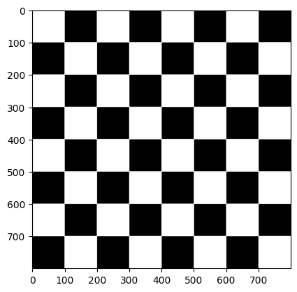

# Práctica 1

En esta primera práctica hemos realizado una toma de contacto con las librerías Numpy y OpenCV. Con la primera de ellas hemos desarrollado tareas sencillas como la generación de formas geométricas, así como nos ha servido de apoyo para generar marcos donde poder mostrar y combinar los resultados obtenidos con las operaciones de OpenCV.

Con OpenCV hemos comprobado que pueden realizarse tareas similares con formas geométricas y primitivas gráficas como las generadas con Numpy, aunque el principal atractivo y aplicación de esta librería se ha centrado en el tratamiento de imágenes y de la entrada de video por webcam.

# Descripción de las tareas planteadas

## Tablero de ajedrez

Para esta tarea hemos empleado un doble bucle dividiendo la figura original en una matriz 8x8 y coloreando de blanco las casillas correspondientes.

## Mondrian

Nuestro generador de Mondrian produce resultados aleatorios cada vez que se ejecuta. Se basa en una función encargada de generar cuadriláteros de manera aleatoria sobre un lienzo en blanco y proyectar las divisiones entre ellos con líneas negras. Las coordenadas de estos cuadrados son guardados en una lista, que será posteriormente iterada para rellenar de manera aleatoria algunos de ellos de un color característico de las obras de Mondrian.

## Tarea previa con funciones de dibujo de OpenCV - Tablero de ajedrez

Debido a la robustez y reusabilidad del bucle que aplicamos en la generación del tablero de ajedrez, decidimos recrear esta tarea con OpenCV. Usando la función para generar una primitiva geométrica, en este caso un cuadrado, el resultado es exactamente el mismo que con Numpy.

## Modificar los valores de un plano de la imagen

En esta tarea se nos pide que modifiquemos uno de lso planos de la imagen capturada por la webcam. En nuestro caso, optamos por modificar dos planos: el rojo y el verde.

- Al plano rojo se le ha aplicado un patrón de cuadrícula.

- Al plano verde se le ha aplicado un patrón de puntos.

## Pintar círculos en las posiciones del píxel más claro y oscuro de la imagen

Para esta tarea hemos recurrido a la función de OpenCV para obtener tanto el valor como las coordenadas del píxel más claro y el más oscuro de la webcam por cada frame. En dichas coordenadas se ha dibujado un pequeño círculo, azul para el píxel más claro y rojo para el más oscuro.

### Zona 8x8 más clara y más oscura

Para esta variante del ejercicio anterior, optamos por analizar una matriz 8x8 centrada en cada píxel de la imagen. Esta forma de enfrentar el problema supone una gran cantidad de procesamiento, por lo que la fluidez de la imagen a tiempo real se ve muy perjudicada. Sin embargo, este enfoque frente a otros como dividir cada fotograma en matrices 8x8 consigue un análisis más exhaustivo de las matrices intermedias que este enfoque no tiene en cuenta (por ejemplo, una matriz que se genere con las 4 columnas más a la derecha de una matriz, y las 4 columnas más a la izquierda de su matriz contigua).

## Propuesta de Pop Art

Para este último apartado hemos generado un marco 3x3 con las propuestas básicas de Pop Art y otras 4 que generamos jugando con los colores al aplicar operaciones matemáticas, asegurándonos siempre de truncar la operación para que no supere el valor máximo aceptado de 255.

