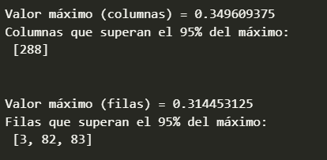

# Práctica 2

Esta segunda práctica se centra en la detección de contornos de una imagen, así como el análisis de la distribución de píxeles claros y oscuros para determinar la disposición de las zonas claras y oscuras de la imagen.
Para ello, se destacan las técnicas de:

- Métodos de Canny y Sobel, y aplicación de umbrales a imágenes B/N para detectar bordes.
- Generación de histogramas sobre la distribución del brillo de los bordes con respecto a filas o columnas de la imagen, con el objetivo de identificar regiones claras y oscuras.

## Autores

- Óscar Muñoz Hidalgo
- Juan José Quesada Acosta

## Requisitos

- Descargar Python version 3 en adelante
- Recomendado tener Anaconda para entornos aislados de python

## Tareas

### Conteo de píxeles blancos por fila y generación del histograma para el resultado de aplicar Canny a la imagen B/N del mandril

De manera similar al método utilizado en el conteo por columnas que se proporciona como ejemplo, replicamos la estructura de código modificando el segundo argumento de la función de '0' a '1' para iterar respecto a las filas:

```python
row_counts = cv2.reduce(canny, 1, cv2.REDUCE_SUM, dtype=cv2.CV_32SC1)
```


### Identificación del valor máximo en filas y columnas, así como aquellas filas o columnas que contengan, al menos, un píxel con valor mayor o igual al 95% del máximo global

En esta tarea hemos aplicado un sencillo bucle para obtener valor máximo y una lista de aquellas filas y columnas que superen dicho umbral.


### Estudio por filas y columnas a la imagen generada de aplicar Sobel

Primero aplicamos umbralizado.


Hacemos conteo por columnas.


Luego hacemos el conteo por filas.


Identificación del máximo por filas y columnas, y aquellas que superan el 95% de dicho máximo.



#### Marcado con primitivas de máximos en ambas imágenes

- Canny


- Sobel


### Exhibición de lo aprendido con webcam

Cambio de efecto de video usando el espacio o el click izquierdo sobre la ventana.

#### Sin Efecto


#### Contornos


#### Diferencia de frames


#### Píxeles más claro y oscuro


### Demo Inspirada en Proyectos Sugeridos

En esta demo se pretende detectar un rango de azules correspondientes con el color de unos guantes de cocina de latex comunes y aplicar una mascara a forma de chroma para reproducir un video sobre estas zonas.

Se reproduce en el lado izquierdo de la ventana una imagen con detección de área y resaltado de máscara y en el lado derecho el resultado final.


Posteriormente se le añadió una detección de contornos y filtrado por formas para cambiar el video de fondo en función de si parecía o no un triángulo del color de la máscara en la escena.


