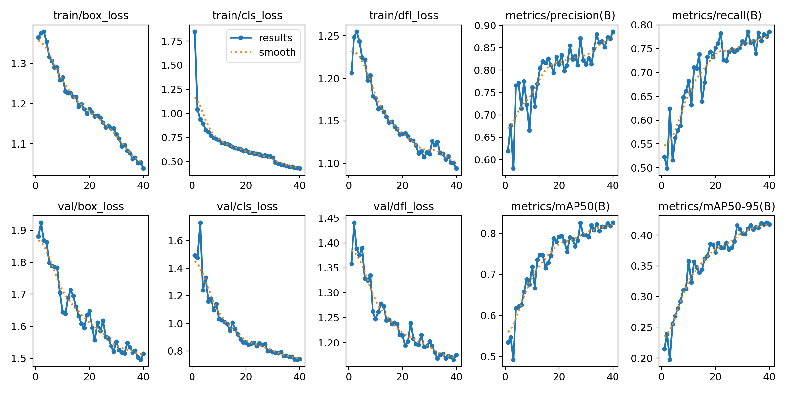
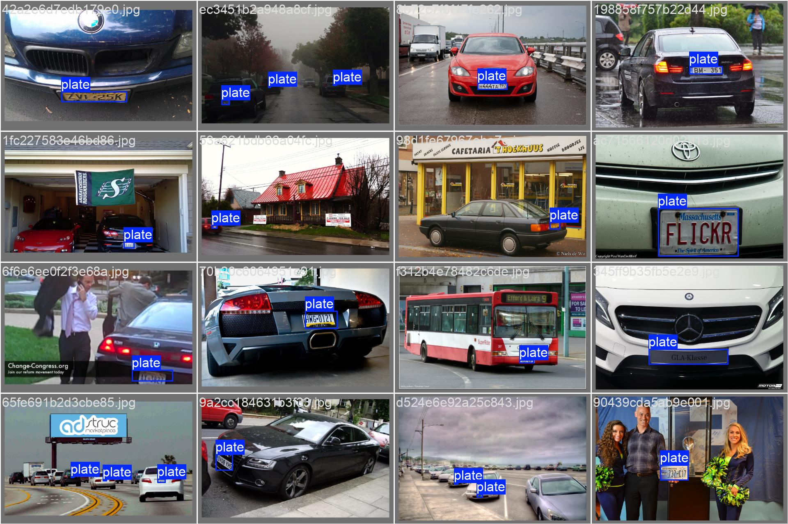
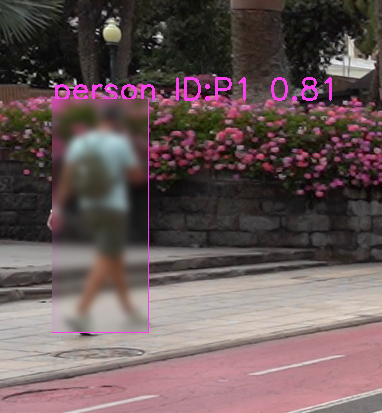
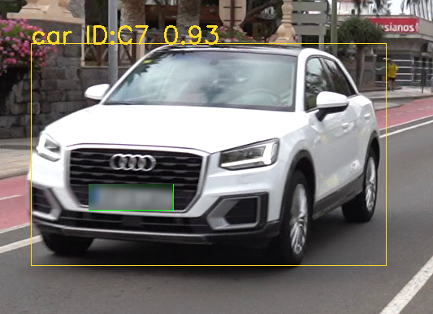
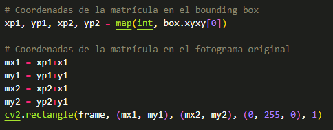
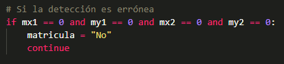
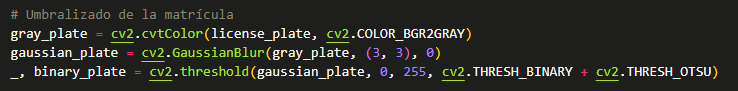
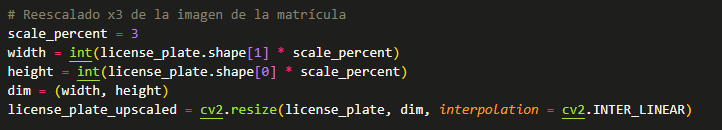
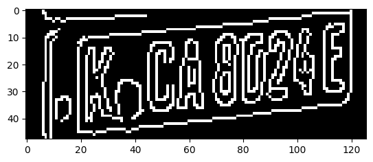
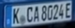

# Práctica 4. Detección de personas, coches y matrículas usando YOLO

En esta práctica hemos implementado dos detectores de objetos basados en YOLOv11, la versión más reciente del modelo de Ultralytics, con el objetivo de detectar personas, coches y sus respectivas matrículas en archivos de vídeo. El resultado de la aplicación de estos dos modelos será un vídeo con:

- Seguimiento y rectángulo contenedor de cada uno de los elementos identificados.
- Reconocimiento de matrículas de los coches detectados.
- Lectura (intento) de las matrículas detectadas usando la librería *pytesseract* como implementación de un OCR.
- Volcado del resultado de la detección en un nuevo archivo de vídeo [**detection_result.mp4**](https://alumnosulpgc-my.sharepoint.com/:v:/g/personal/juan_quesada108_alu_ulpgc_es/EWA-sMiBxhJBjdghSf3fcJEBhV6w6ZEZ79TNMb4utaqfyg?nav=eyJyZWZlcnJhbEluZm8iOnsicmVmZXJyYWxBcHAiOiJPbmVEcml2ZUZvckJ1c2luZXNzIiwicmVmZXJyYWxBcHBQbGF0Zm9ybSI6IldlYiIsInJlZmVycmFsTW9kZSI6InZpZXciLCJyZWZlcnJhbFZpZXciOiJNeUZpbGVzTGlua0NvcHkifX0&e=0rW4DC) reflejando los elementos anteriores. Acceso al vídeo a través de OneDrive debido al tamaño.
- Generación de un archivo CSV (**results.csv**) con un análisis de las detecciones por fotograma con el siguiente formato.

```
fotograma, tipo_objeto, confianza, identificador_tracking, x1, y1, x2, y2, matrícula_en_su_caso, confianza, mx1,my1,mx2,my2, texto_matricula
```

## Autores

- Óscar Muñoz Hidalgo
- Juan José Quesada Acosta

## Contenidos

[Entrenando nuestro propio detector de matrículas](#entrenando-nuestro-propio-detector-de-matrículas)  

[Hora de combinar modelos](#hora-de-combinar-modelos)

- [Introduciendo el detector de matrículas](#introduciendo-el-detector-de-matrículas)

- [Transformaciones de la imagen para una mejor lectura](#transformaciones-de-la-imagen-para-una-mejor-lectura)

- [El dilema de pytesseract](#el-dilema-de-pytesseract)

[Análisis de los resultados](#análisis-de-los-resultados)

- [Pruebas con otros vídeos](#pruebas-con-otros-vídeos)

## Paquetes a instalar

```
conda create --name VC_P4 python=3.9.5
conda activate VC_P4
pip install ultralytics
pip install lapx
conda install pytorch==1.12.1 torchvision==0.13.1 torchaudio==0.12.1 cudatoolkit=12.4 -c pytorch -c conda-forge
pip install pytesseract
```

*Hemos usado también el toolkit de CUDA y cuDNN para el entrenamiento de nuestro detector de matrículas, corriendo en una RTX 3060 Laptop con 6GB VRAM.

## Entrenando nuestro propio detector de matrículas

Para la detección de matrículas decidimos optar por entrenar nuestro propio modelo de YOLOv11. Tomando [este](https://www.kaggle.com/datasets/fareselmenshawii/large-license-plate-dataset) dataset, construimos un subset del mismo reduciéndolo a un 1/5 de su tamaño y tomando aletoriamente pares imagen-anotación para evitar posibles sesgos debidos al orden de las imágenes en el dataset original.

Con ello, lanzamos un proceso de entrenamiento tomando como base el modelo yolov11n y entrenando con dicho subset durante 40 épocas.

El archivo con los pesos resultantes puede encontrarse en la ruta:

*yolov11-plates/weights/yolov11-plates-best.pt*

El resultado del entrenamiento puede observarse a continuación:



Algunos ejemplos de las imágenes del subconjunto de validación durante el entrenamiento del modelo:



## Hora de combinar modelos

Una vez entrenado nuestro modelo, podemos pasar a la acción. Inicialmente lanzamos el modelo general de YOLO para detectar personas y coches, usando la opción **track**, que nos facilitará la tarea del seguimiento. Hemos identificado cada clase con un prefijo P para persona y C para coche, así como de un contador numérico que lo acompaña.
Se ha coloreado además la bounding box de cada elemento detectado de la siguiente manera:





*Como extra se ha añadido la opción de censura de personas y matrículas como puede observarse, implementado de una manera muy sencilla. Basta con extraer la región de interés (dada por la bounding box) y aplicar un desenfoque gaussiano a esa zona de la imagen.

### Introduciendo el detector de matrículas

En cuanto se detecta un coche, la región que lo encierra es recortada y enviada al modelo detector de matrículas, el cual tratará de identificar la región casi exacta que encierra la matrícula.
Además, hemos tenido que normalizar las coordenadas, pues al obtener la bounding box de la mátricula, sus coordenadas vienen expresadas respecto a la región que encierra el coche:



Y posteriormente se le ha incluido un pequeño filtro para evitar falsas detecciones en caso de que sus coordenadas fueran nulas:



### El dilema de pytesseract y transformaciones de la imagen para una mejor lectura

Con esta bounding box detectada, que ciertamente tiene muy buenos resultados, nos enfrentamos al mayor problema de la práctica: que el OCR elegido fuera capaz de leer los caracteres alfanuméricos de las matrículas. En nuestro caso elegimos **pytesseract** y estuvimos batallando durante horas para conseguir resultados mínimamente coherentes. Sin embargo, fue tarea imposible, aunque a continuación detallamos todos nuestros intentos de transformar la imagen para facilitarle el trabajo a **pytesseract**:

- Umbralizado de la imagen con Otsu posterior a desenfoque gaussiano.



- Reescalado a 3 veces más resolución con interpolación lineal.



- Aplicando técnicas usadas con el detector de monedas como la detección de bordes con Canny o la detección de contornos individuales para cada caracter con cv2.findContours.



Tratamos de usar la opción *image_to_data* de pytesseract por si el tratamiento podía llegar a ser más efectivo al separar las diferentes detecciones en entradas de un diccionario (que no cambió en casi nada el resultado), así como para obtener la confianza de la lectura de matrícula.

Y el resultado era prácticamente el mismo: una tragedia. Sin embargo, esto es parcialmente comprensible, pues estos OCRs están entrenados con imágenes de libros, por lo que puede entenderse su desempeño tan deficiente en esta aplicación.

## Análisis de los resultados

Podemos sacar en claro que las tareas llevadas a cabo con YOLO han tenido un desempeño excelente, pues la detección de personas y coches del modelo básico se desenvuelve en casi cualquier ambiente. Pero aún más nos sorprendieron los resultados del detector de matrículas que entrenamos y que fue capaz de detectar matrículas hasta en el reflejo de otro coche (ojalá haber conseguido una captura de pantalla), o en caravanas y muy a lo lejos entre coches.

En cuanto a la lectura de matrícula, pensamos que podríamos haber conseguido un mejor resultado entrenando otro modelo de YOLO para la detección de caracteres, concatenando los resultados individuales a partir de la posición de las bounding boxes cercanas entre sí.

### Pruebas con otros vídeos

Hemos subido otros vídeos de cosecha propia, donde para uno de ellos se generó un vídeo con la detección a tiempo real y que incluimos como GIF a continuación (video original también incluido en el repo *detection_results_coches.mp4*).


También incluimos otro vídeo con el que hicimos pruebas a tiempo real más rápido, cuyo nombre es *capri.mp4* y del que pudimos extrar una matrícula clara y casi en estático para verificar que efectivamente el desempeño de los OCRs para este tipo de tareas es muy malo.


