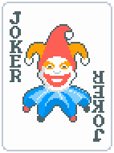

# Práctica 5. Detección y caracterización de caras

En esta práctica hemos realizado una aplicación para un detector de caras en la que recreamos el aspecto del personaje básico principal del videojuego Balatro conocido como Joker (equivalente a la carta del Joker en el póker).




El resultado ha sido el siguiente, del que podemos destacar:

- La capacidad de rotación del sombrero acorde a la rotación de la cara.
- La aplicación de un contorno de ojos y de boca simulando el maquillaje del Joker.
- La capacidad de aplicar el filtro a tiempo real a un máximo de 2 personas.


## Autores

- Óscar Muñoz Hidalgo
- Juan José Quesada Acosta

## Contenidos

[](#)

## Paquetes a instalar

```
conda create --name VC_P5_G13 python=3.9.5
conda activate VC_P5_G13

pip install opencv-python
pip install mediapipe
pip install numpy
```

## 
